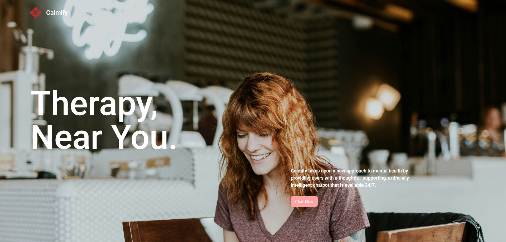
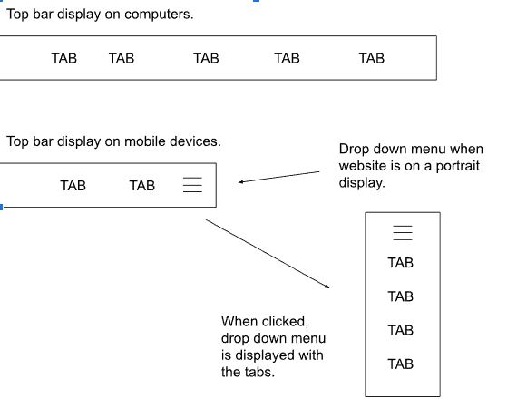
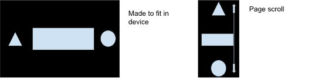
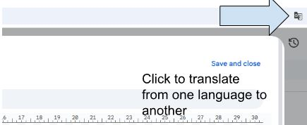
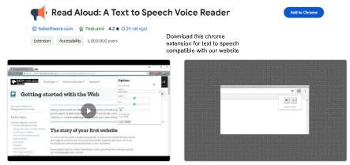
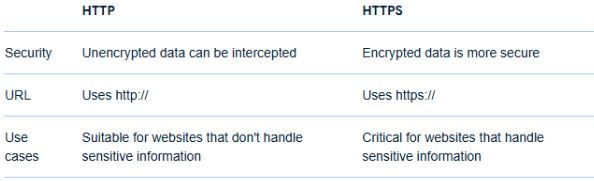
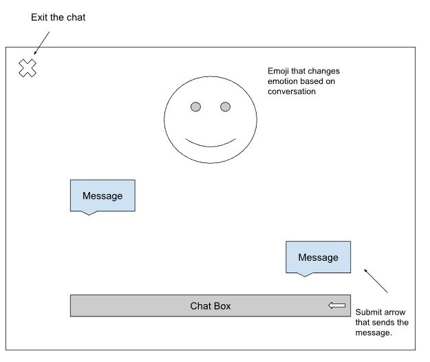

# Calmify


A therapy designed chat bot created using HTML, Tailwind CSS, Javascript, and Node.js

Features:

- Send Messages to the Chat bot by typing your prompt which calls the Ollama API
- AI responds with messages
- Responsive Design

Tools Used:

- HTML
- Tailwind CSS
- Javascript
- Ollama API
- VSCode

## Installation
Clone the project using https://github.com/AndrewC145/Calmify.git

Change to the directory and type 
```
npm install
```
Enable live server and index.html


## Problem Statement: How can we make our website accessible for everyone?

Ideas:

- We must make it so the resolution of our website adjusts based on the user's device.
- A smaller device will adjust it so the UI changes into a more compact design
- Tabs are fully displayed on a bar for computers, but when it comes to smaller screens they are placed in a drop down tab in the top right.



- Images are either replaced with confined ones or shrunken or non-important parts are cut out.
- For mobile devices web pages are resized into thin, but long scroll like pages.



- We must make it so that the amount of animations that are displayed for a computer are reduced for smaller devices which run on smaller hardware.
- Include a list of different languages to display the website in.



- Make sure our website is compatible with the majority of chrome extensions
- Make sure our website can be accessed by blind individuals



- Make sure our website can be accessed by colour blind individuals
- Have our website have Alphabetic characters from other languages
- Have our website be secure and private using https instead of http



- Have our website be saved as cache so you don't have to download the assets repeatedly to open it
- Have our website be dynamic and interactive
- Have our website not have flashing lights for epileptic individuals
- Have our website be simple so elderly can access it

### Pressing the Chat Now opens the chat menu.



#### Summarized Solution

In summary, the basis of our plan is to make our website accessible which will be achieved by tweaking a bunch of the UI, inner workings, display, features, etc. We agree that the most important functions to focus on are the ones that allow the website to be displayed on a range of devices. All ideas stated above work together making our website accessible, such as grouping the tabs to a drop down menu located on the top right corner when the website is shrunken, reducing background animations that use hardware, and adjusting web pages into a long scroll-like page which help the website run better on smaller devices. We also provided security from HTTP to HTTPS so our user can sleep calmly as their information isn't leaked for ease of access. On top of that, making the website visually appealing will make it much easier for many users. We want to implement language change, simple designs, large fonts, color coordinated UI, an instructions page, color blind adjustment, assistance for the hard of hearing as well as the visually impaired, etc.
